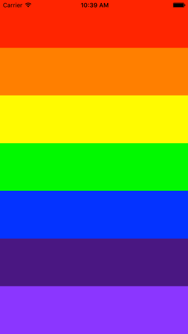

# Projeto 1: Arco-íris

Este projeto é parte do curso **Aplicativos Móveis com o React Native**, criado por Renan Martins (@nbkhope).

[Clique aqui para acessar o curso](https://www.udemy.com/course/aplicativos-moveis-com-o-react-native/).

## Screenshot

